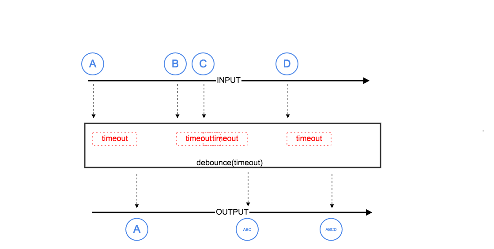

| README.md |
|:---|

# Sug Debounce

<p align="center"> 

</p>

Sometimes, we need to listen for changes in the TextView(also EditText) content, especially for some Android apps that support search, [search suggestions](https://en.wikipedia.org/wiki/Search_suggest_drop-down_list) is a very important feature that enhances the user experience. In general,
Android developers prefer to use [TextWatcher](https://developer.android.com/reference/android/text/TextWatcher.html) to listen to [TextView](https://developer.android.com/reference/android/widget/TextView.html) content changes, such as follows

```java
    textView.addTextChangedListener(new TextWatcher() {
      @Override public void beforeTextChanged(CharSequence s, int start, int count, int after) {

      }

      @Override public void onTextChanged(CharSequence s, int start, int before, int count) {

      }

      @Override public void afterTextChanged(Editable s) {

        /*do suggestion search*/
        doSearch(s.toString());
      }
    });
```


However, there is a problem here. If you want to search for "California," you may need at least four network requests such as "c", "a", "l", "i" to get the desired suggestions list.
And these asynchronous network requests may eventually show the wrong suggestion list, without any special handling.


User experience! User experience! User experience! The important thing to speak three times!

**We should do some debounce to avoid unnecessary network requests and avoid wasting bandwidth.**

*It's similar to [javascript-debounce-function](https://davidwalsh.name/javascript-debounce-function).*


## Getting Started

**Download**

[](https://jitpack.io/#SmartDengg/sug-debounce)

Step 1. Add it in your root build.gradle at the end of repositories:

```groovy
    allprojects {
        repositories {
            maven { url 'https://jitpack.io' }
        }
    }
```

Step 2. Add the dependency

```groovy
	dependencies {
		implementation 'com.github.User:Repo:Tag'
	}
```

**Useage** 

```java
    Debounce.onAfterTextChangedAction(textView, 300,
        new DebounceObserver<TextViewAfterTextChangeEvent>() {
          @Override public void onError(Throwable throwable) {

          }

          @Override public void onSuccess(TextViewAfterTextChangeEvent event) {
          
            /*do your search*/
            doSearch(event.editable().toString());
          }
```

You can change the denounce `timeout`, but we recommend 300 ~ 400 ms.

## Debounce VS No-Debounce


**Debounce**

[](https://www.youtube.com/watch?v=Pi96OY5TkPQ)

**No-Debounce**

[](https://www.youtube.com/watch?v=boIsA7XvHyE)


## How it works

<p align="center"> 

</p>


## Proguard

TO-DO


## Found this project useful

<p align="center">:heart: Hope this article can help you. Support by clicking the :star:, or share it with people around you. :heart:  </p>


## About author

Email : dengwei@lianjia.com

weibo : [-小鄧子-](https://weibo.com/5367097592/profile?topnav=1&wvr=6)


## License

See the [LICENSE](LICENSE.md) file for license rights and limitations (MIT).


